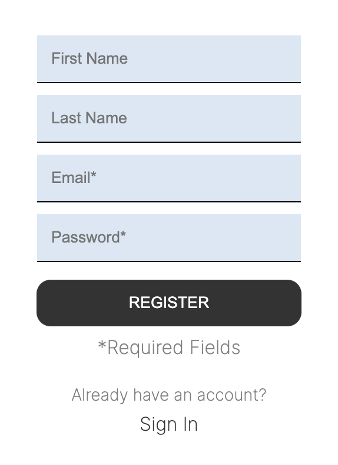
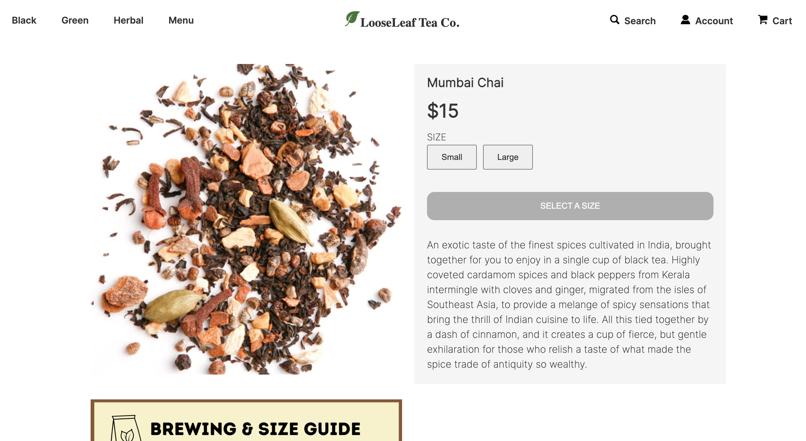
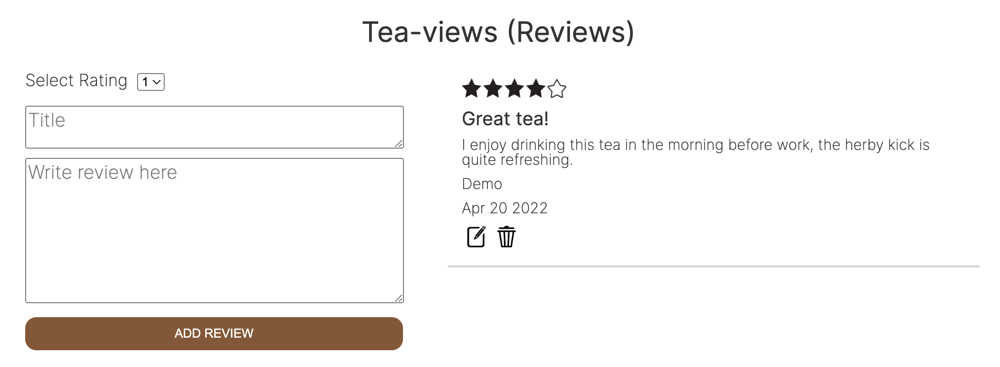
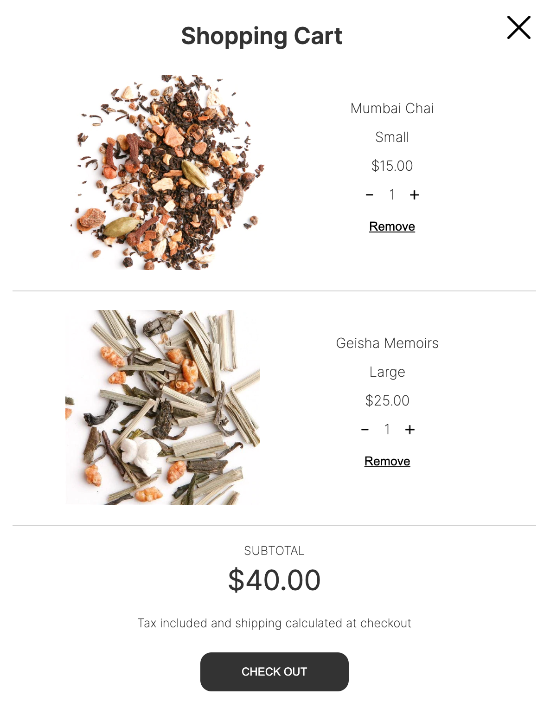
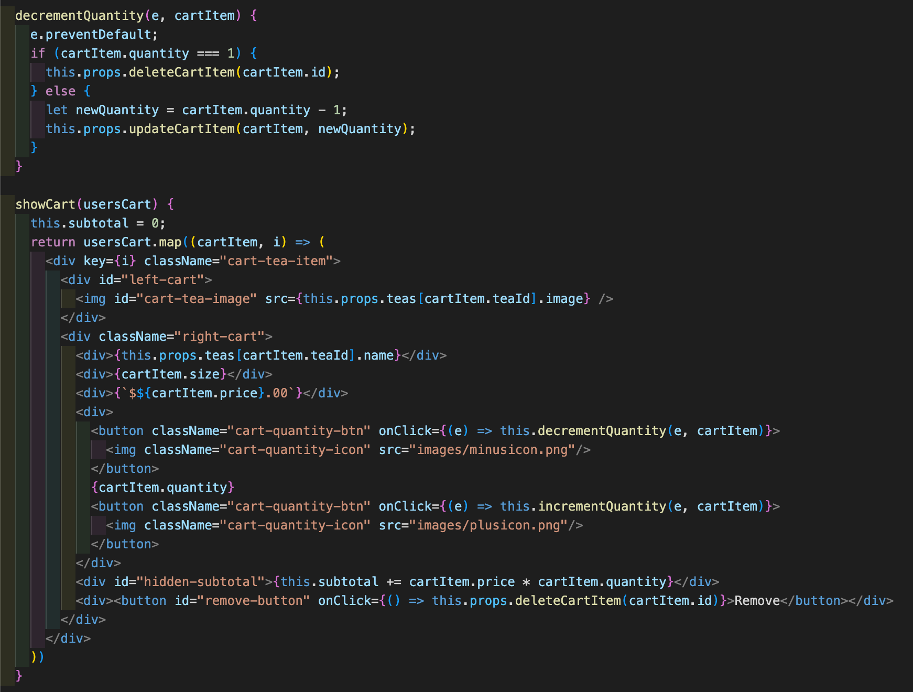
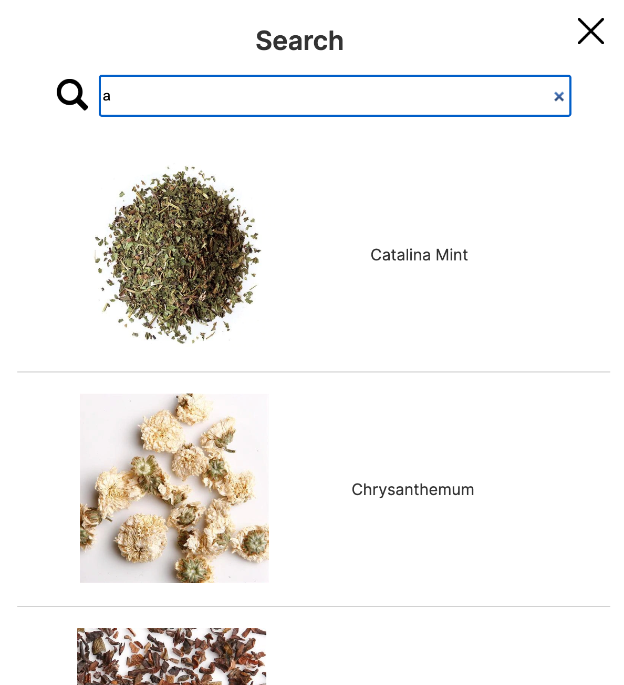

# LooseLeaf Tea

[Click to view!](https://looseleaf-tea.herokuapp.com/#/)

## Background
LooseLeaf Tea is a site clone of Burlingame, CA based tea company/cafe, [Leland Tea](https://lelandtea.com/). In addition to being an avid tea enthusiast and faithful supporter of local businesses, I chose this website particularly for it's clean, modern, and easily navigatable layout.

## Features
### User Auth/Demo Login

LooseLeaf Tea has a fully functional user auth system, with error handling and a demo login for quick access to the site's features. There is a question in both the register and login page that prompts the user to switch to either page, allowing ease of transition as necessary. Furthermore, the login page is automatically rendered if the user attempts to add an item to cart, or leave a review, without first signing in.

### Product Show Page/Reviews

Each tea has a dedicated show page complete with reviews. Users can create reviews, as well as edit/delete their own existing reviews. There is error handling - a review will not be submitted and a message will pop up if the user does not fill in all fields. In addition, users do not have the option to add a tea to their cart until a size has been chosen.

### Cart

Clicking the cart link in the navigation bar, and adding a tea to cart, will open the sliding cart sidebar. There users can modify the quantity of each item. The code snippet above handles the main logic of the cart component. The decrement quantity function will decrease an item's quantity by one, unless there is only one, in which case it will remove the item entirely. The subtotal defined in the constructor is updated with each item listed, but residing in a hidden div element until it is shown at the bottom of the cart.

### Dynamic Search Bar

Similar to the cart, clicking on the search link will open a sliding sidebar. Here users can type in any letter/word, and a list of teas including said letter/word in the name will immediately render/modify as the input changes. Each search item listed is a link that will navigate users to the specific product's show page.

## Technologies Implemented
* Ruby on Rails
* React/Redux
* JavaScript/AJAX/JBuilder
* PostgreSQL
* HTML5 & CSS
* AWS S3
* Heroku